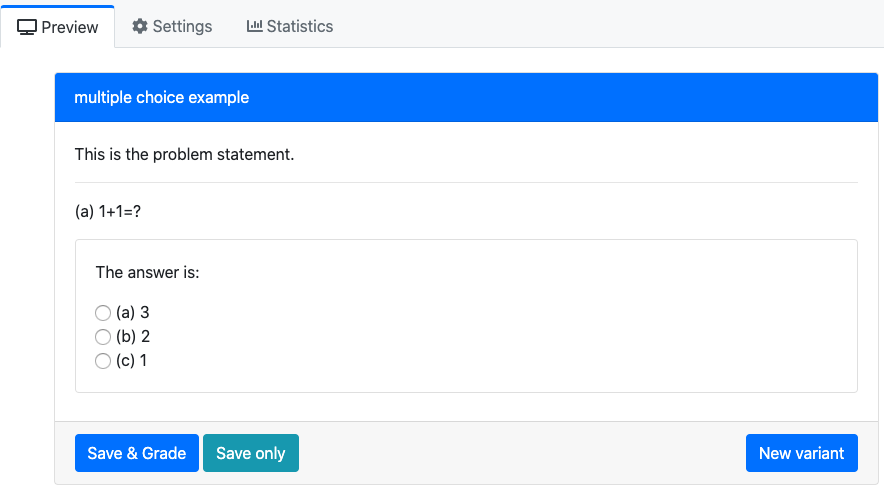

# Multiple Choice

Reference: ([link](https://prairielearn.readthedocs.io/en/latest/elements/#pl-multiple-choice-element))

The multiplice choice only requires you to modify:

| Folder/File Name                                    | Usage                                                        |
| --------------------------------------------------- | ------------------------------------------------------------ |
| **if this is a standalone problem:** info.json      | The information of the question such as title, topic, tags, and uuid. |
| **if you want have conditional answers**: server.py | Set up the condition for answers                             |
| question.html                                       | The main body of the question                                |

A `pl-multiple-choice` element selects **one** correct answer and zero or more
incorrect answers and displays them in a random order as radio buttons.

## An example of the `question.html`

```html
<pl-question-panel>
	<p> 
	This is the problem statement.
	</p>
</pl-question-panel>

<pl-question-panel><hr></pl-question-panel>
<pl-question-panel>
	<p>
	    (a) 1+1=?
	</p>
</pl-question-panel>

<div class="card my-2">
    <div class="card-body">
        <pl-question-panel>
            <p> 
                The answer is:
            </p>
        </pl-question-panel>

        <pl-multiple-choice answers-name="answer_a" weight="2">
        	<pl-answer correct="false"> 1 </pl-answer>
		    	<pl-answer correct="false"> 3 </pl-answer> 
		    	<pl-answer correct="true"> 2 </pl-answer> 
        </pl-multiple-choice>
    </div>
</div>
```

The problem will be:



When you clicked the correct answer:


## Conditional Answers

Assume we want to have conditional answers, for instance, the answers of the multiple choice depend on the previous answer. Here we have an example, the `p-value` is calculated from previous answer (we omiss how to get `p`, but use the function `sample` as an example). Here the `p` (in Python is p, in R is p_r, use the function `ans=list(...)` to convert) value could be `0.5` or `0.005`. The idea is:

If p<0.01, the correct answer is True (reject), and vice versa. 

### server.py

Please note the order for the conditional answers, otherwise the commands `data['correct_answers'] = ans` and `data["params"] = ans` will overwrite your conditional answers. 

```python
def generate(data):
    values = robjects.r("""
        p_r = sample(c(0.005,0.5),1)
        
        # Export
        list(  
             ans = list(p=round(p_r,digits=3))
       )
    """)

    ans = values[0]
    # Convert from R lists to python dictionaries
    ans = { key : ans.rx2(key)[0] for key in ans.names }
    # Setup output dictionaries
    data['correct_answers'] = ans
    data["params"] = ans
		
    # Here is the start for the conditional answers
    if data['correct_answers']["p"]<0.01:
        # The option "True" in question.html is correct
        data['params']["answer_b_true"] = True
        data['params']["answer_b_false"] = False
    else:
        # The option "True" in question.html is incorrect
        data['params']["answer_b_true"] = False
        data['params']["answer_b_false"] = True
```

### question.html

```html
<pl-question-panel><hr></pl-question-panel>
<pl-question-panel>
    <p>
        (b) If the p-value is ${{params.p}}$, we should reject $H_0$
    </p>
</pl-question-panel>

<div class="card my-2">
    <div class="card-body">
        <pl-question-panel>
            <p> 
                The answer is:
            </p>
        </pl-question-panel>

        <pl-multiple-choice answers-name="answer_b" weight="2">
          <pl-answer correct="{{params.answer_b_true}}"> True </pl-answer>
          <pl-answer correct="{{params.answer_b_false}}"> False </pl-answer> 
        </pl-multiple-choice>
    </div>
</div>
```

### Appearance

1. If p-value is `0.005`


2. If p-value is `0.5`


## Customizations

| Attribute        | Type    | Default | Description                                                  |
| ---------------- | ------- | ------- | ------------------------------------------------------------ |
| `answers-name`   | string  | —       | Variable name to store data in.                              |
| `weight`         | integer | 1       | Weight to use when computing a weighted average score over elements. |
| `inline`         | boolean | false   | List answer choices on a single line instead of as separate paragraphs. |
| `number-answers` | integer | special | The total number of answer choices to display. Defaults to displaying one correct answer and all incorrect answers. |
| `fixed-order`    | boolean | false   | Disable the randomization of answer order.                   |

Inside the `pl-multiple-choice` element, each choice must be specified with
a `pl-answer` that has attributes:

| Attribute | Type    | Default | Description                               |
| --------- | ------- | ------- | ----------------------------------------- |
| `correct` | boolean | false   | Is this a correct answer to the question? |